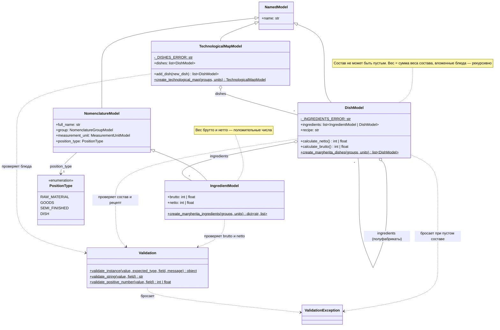
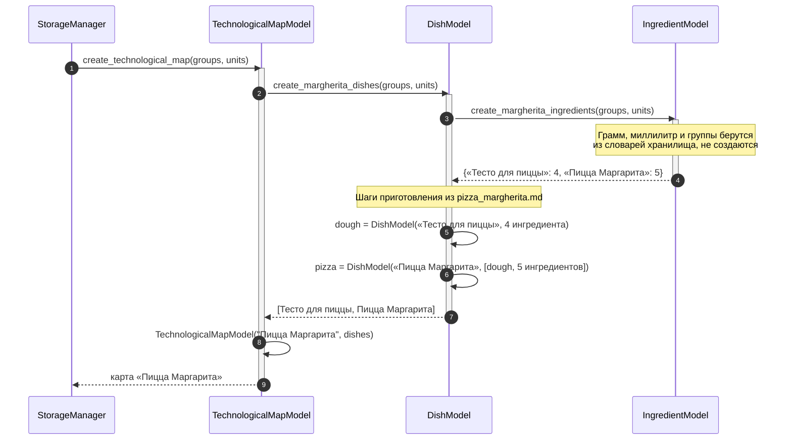
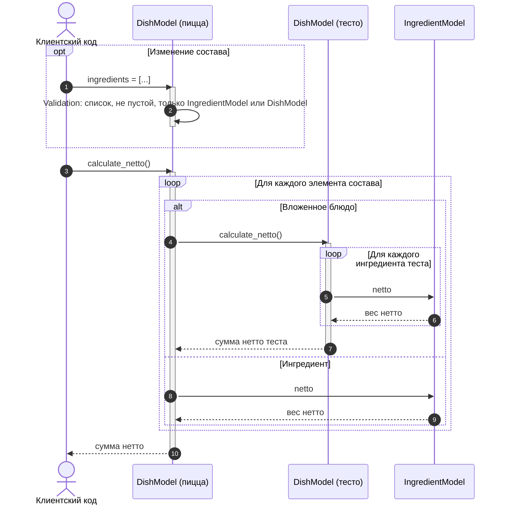

# UML: модели рецептов

Модели рецептов лежат в `Src/Models/` и описывают составную технологическую карту (п. 2.5 ТЗ):
карта состоит из блюд, блюдо — из ингредиентов и текста рецепта. Данные взяты из
[рецепта пиццы Маргарита](../recipes/pizza_margherita.md).
Пунктирная стрелка — зависимость (создаёт, проверяет или бросает), закрашенный ромб — владение,
пустой ромб — объекты переданы извне.

## Модели

`IngredientModel` — номенклатура с весом брутто и нетто, поэтому наследуется от `NomenclatureModel`.
`DishModel` хранит непустой состав и рецепт приготовления. В состав входят ингредиенты и вложенные
блюда-полуфабрикаты (шаблон «Компоновщик»), поэтому `calculate_brutto()` и `calculate_netto()`
рекурсивны: вес ингредиента берётся как есть, вес вложенного блюда считается тем же методом.
`TechnologicalMapModel` хранит блюда; карта без блюд создаётся пустой, `add_dish()` добавляет блюдо.
Свойства-списки возвращают копии, поэтому изменить состав можно только через сеттер или `add_dish()`.

Рецепт составной: полуфабрикат «Тесто для пиццы» — отдельное блюдо карты и одновременно элемент
состава пиццы, тот же объект. Вода в номенклатуре не учитывается, поэтому вес теста — 160 г, а пиццы —
160 + 291 = 451 г.

Фабрики не создают единицы измерения и группы сами: `StorageManager` передаёт по цепочке
карта → блюда → ингредиенты свои словари `groups` и `units`, поэтому у ингредиентов те же объекты
грамма, миллилитра и групп, что и в хранилище, без дублей.

Группа, единица измерения и базовая иерархия `AbstractModel` → `NamedModel` — на
[диаграмме StorageManager](storage_manager.md) и [диаграмме SettingsManager](settings_manager.md).

## Последовательность: создание технологической карты

Фабрики вызываются цепочкой сверху вниз: карта просит блюда, блюда — ингредиенты.
`StorageManager.convert()` вызывает `create_technological_map(groups, units)` при первом старте
и передаёт свои словари групп и единиц измерения.

## Последовательность: расчёт веса блюда

Вес считается при каждом вызове, поэтому изменение состава через сеттер `ingredients`
(добавление или исключение ингредиента), в том числе у вложенного блюда, сразу меняет результат.
`calculate_brutto()` устроен так же, как `calculate_netto()`, только берёт `brutto`.

