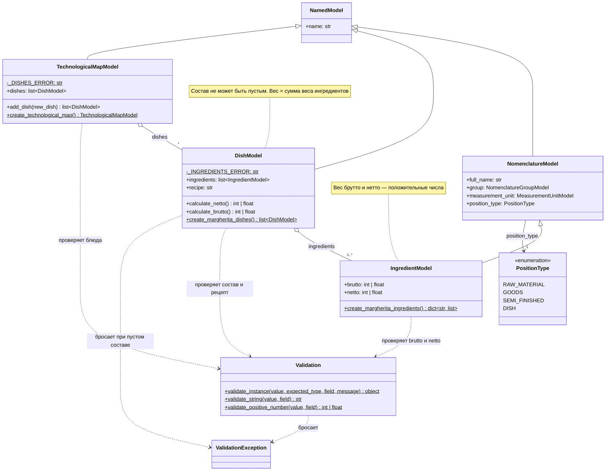
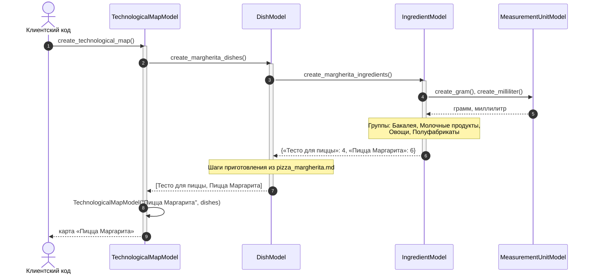
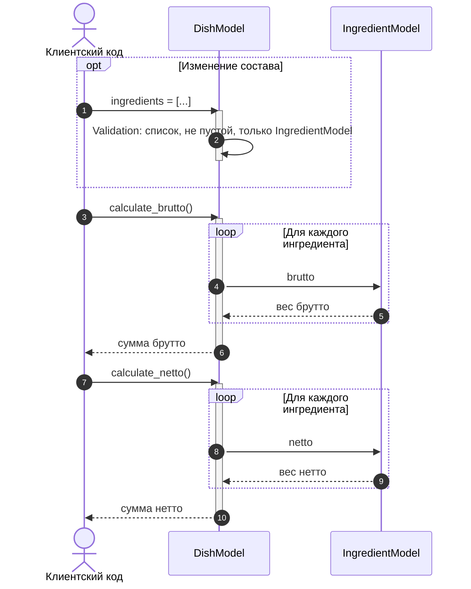

# UML: модели рецептов

Модели рецептов лежат в `Src/Models/` и описывают составную технологическую карту (п. 2.5 ТЗ):
карта состоит из блюд, блюдо — из ингредиентов и текста рецепта. Данные взяты из
[рецепта пиццы Маргарита](../recipes/pizza_margherita.md).
Пунктирная стрелка — зависимость (создаёт, проверяет или бросает), закрашенный ромб — владение,
пустой ромб — объекты переданы извне.

## Модели

`IngredientModel` — номенклатура с весом брутто и нетто, поэтому наследуется от `NomenclatureModel`.
`DishModel` хранит непустой список ингредиентов и рецепт приготовления и считает вес блюда:
`calculate_brutto()` и `calculate_netto()` складывают вес всех ингредиентов. `TechnologicalMapModel`
хранит блюда; карта без блюд создаётся пустой, `add_dish()` добавляет блюдо.
Свойства-списки возвращают копии, поэтому изменить состав можно только через сеттер или `add_dish()`.

Рецепт составной: полуфабрикат «Тесто для пиццы» — отдельное блюдо карты и одновременно ингредиент
пиццы с типом `SEMI_FINISHED`. Связь между ними — по наименованию.

Группа, единица измерения и базовая иерархия `AbstractModel` → `NamedModel` — на
[диаграмме StorageManager](storage_manager.md) и [диаграмме SettingsManager](settings_manager.md).

## Последовательность: создание технологической карты

Фабрики вызываются цепочкой сверху вниз: карта просит блюда, блюда — ингредиенты.
`StorageManager.convert()` вызывает `create_technological_map()` при первом старте.

## Последовательность: расчёт веса блюда

Вес считается при каждом вызове, поэтому изменение состава через сеттер `ingredients`
(добавление или исключение ингредиента) сразу меняет результат.

