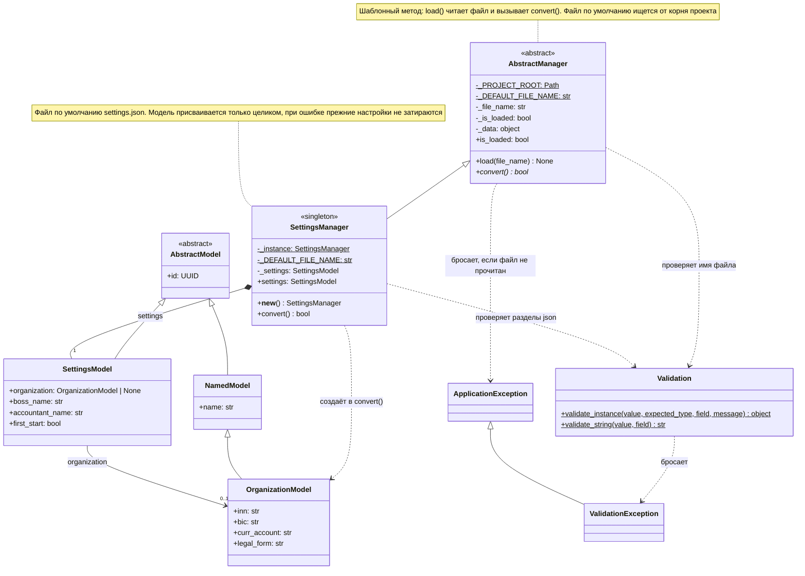

# UML: SettingsManager

Менеджеры лежат в `Src/Logics/`, общий базовый класс `AbstractManager` — в `Src/Core/`.
Порядок работы задаёт базовый `load()`: он читает json-файл в `_data` и вызывает `convert()`,
который реализует наследник. Признак `is_loaded` и имя файла меняются только после успешного
`convert()`, поэтому неудачная загрузка не затирает прежнее состояние.
Пунктирная стрелка — зависимость (создаёт, проверяет или бросает), закрашенный ромб — владение.

## SettingsManager

Singleton: `__new__` возвращает экземпляр, сохранённый в `_instance`, а `__init__` создаёт состояние
только один раз — все `SettingsManager()` в программе указывают на один объект с одними настройками.
Читает `settings.json` из корня проекта и собирает из раздела `company` и флага `first_start`
модель `SettingsModel`. Ошибки в данных бросают `ValidationException` — из `Validation` или из сеттеров
моделей; если файл не прочитан, `load()` бросает `ApplicationException`.

