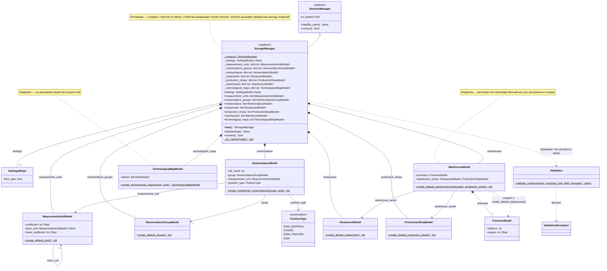
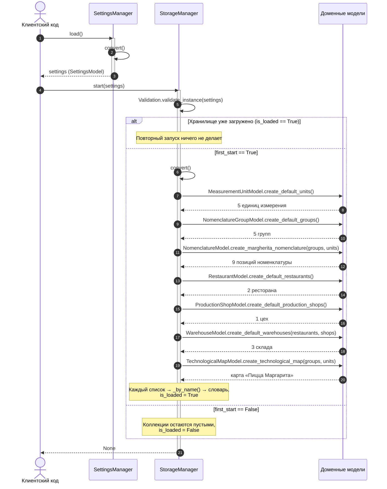

# UML: StorageManager

Хранилище доменных моделей — singleton, по аналогии с `SettingsManager`: `__new__` возвращает экземпляр
из `_instance`, поэтому справочники одинаковы в любом месте программы. Наследуется от `AbstractManager`
и переопределяет `convert()`, который формирует первичные данные фабричными методами доменных моделей.
Пунктирная стрелка — зависимость (создаёт, проверяет или бросает), закрашенный ромб — владение,
пустой ромб — объект передан извне.

## StorageManager

Хранит справочники в семи коллекциях — словарях с ключом по имени: единицы измерения, группы
номенклатуры, номенклатура, склады, рестораны и производственные цеха как владельцы складов,
а также технологические карты. Повтор имени в данных — ошибка, поэтому каждый элемент уникален.

`start(settings)` получает настройки извне. При первом старте (`first_start = true`) он вызывает
`convert()`, и тот формирует первичные данные: 5 единиц измерения, 5 групп, 9 позиций номенклатуры
для рецепта пиццы Маргарита, 2 ресторана, 1 цех, 3 склада и 1 технологическую карту.
При `first_start = false` коллекции остаются пустыми, а повторный запуск после формирования данных
ничего не делает.

`convert()` создаёт данные по порядку: единицы → группы → номенклатура → рестораны → цех → склады →
технологическая карта. Объекты создают фабричные методы `create_*` доменных моделей и возвращают
списки, а `_by_name()` превращает каждый список в словарь с ключом по имени. Фабрикам номенклатуры,
складов и технологической карты передаются уже созданные словари, поэтому ссылки (группа, единица
измерения, владелец склада, единицы и группы ингредиентов рецепта) ведут на тот же объект
из коллекции, а не на копию. Модели технологической карты — на [диаграмме рецептов](recipes.md).

Все модели справочников наследуются от `NamedModel` (свойство `name`) и `AbstractModel` (свойство `id`),
иерархия и полная `SettingsModel` — на [диаграмме SettingsManager](settings_manager.md).

## Последовательность: запуск хранилища

Клиентский код сам загружает настройки через `SettingsManager` и передаёт готовую `SettingsModel`
в `start()` — хранилище не обращается к менеджеру настроек. При первом старте `convert()` вызывает
фабричные методы моделей по порядку и собирает из каждого списка словарь через `_by_name()`.

