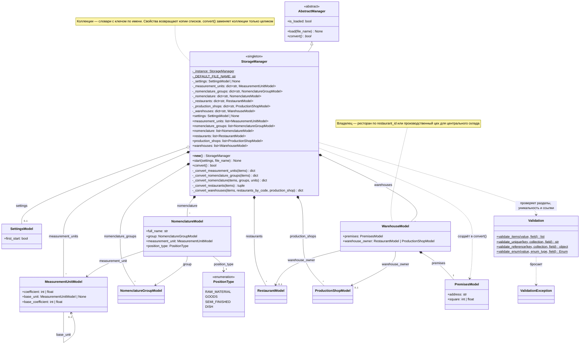

# UML: StorageManager

Хранилище доменных моделей — singleton, по аналогии с `SettingsManager`: `__new__` возвращает экземпляр
из `_instance`, поэтому справочники одинаковы в любом месте программы. Наследуется от `AbstractManager`
и переопределяет `convert()`, а порядок «прочитать файл → преобразовать» задаёт базовый `load()`.
Пунктирная стрелка — зависимость (создаёт, проверяет или бросает), закрашенный ромб — владение,
пустой ромб — объект передан извне.

## StorageManager

Хранит справочники в шести коллекциях — словарях с ключом по имени: единицы измерения, группы
номенклатуры, номенклатура, склады, а также рестораны и производственные цеха как владельцы складов.
Повтор имени в данных — ошибка, поэтому каждый элемент уникален.

`start(settings)` получает настройки извне. При первом старте (`first_start = true`) он вызывает `load()`,
и `convert()` формирует первичные данные из `settings.json` — сейчас это 5 единиц измерения, 7 групп,
13 позиций номенклатуры, 10 ресторанов, 1 цех и 11 складов. При `first_start = false` коллекции
остаются пустыми, а повторный запуск после успешной загрузки ничего не делает.

`convert()` собирает данные по порядку: единицы → группы → номенклатура → рестораны → цех → склады.
Ссылки по имени (базовая единица, группа, единица измерения) и по коду ресторана разрешаются в тот же
объект, что лежит в коллекции, а не в копию. Ошибка в данных бросает `ValidationException`, а коллекции
заменяются только после обработки всех разделов — прежние данные при ошибке сохраняются.

Все модели справочников наследуются от `NamedModel` (свойство `name`) и `AbstractModel` (свойство `id`),
иерархия и полная `SettingsModel` — на [диаграмме SettingsManager](settings_manager.md).
